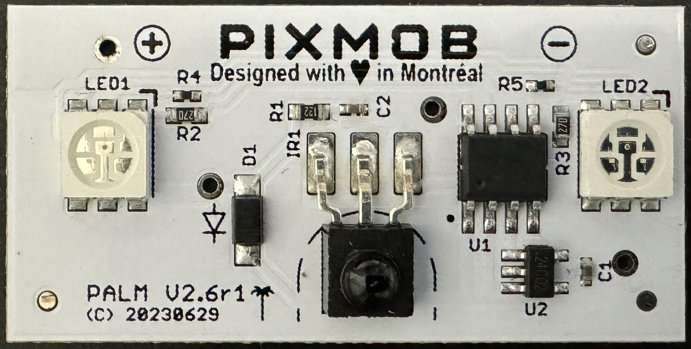

# PixMob IR Reverse Engineering
PixMob wristbands are small, light-up devices distributed to audience members at concerts or other live events. The devices are controlled remotely using radio frequency (RF), Bluetooth Low Energy (BLE), or 38 kHz modulated infrared light (IR) to illuminate special effects and shapes spread across the crowd. 

However, after the conclusion of an event, PixMob devices are left in a state of limited functionality and cannot be customized by the user without access to special software.

This project primarily focuses on reverse engineering and documenting the modes of operation and communications protocol for IR-based PixMob devices by extracting and analyzing the firmware on the device's microcontroller (MCU).

## Devices Models
The table below documents the different IR-based PixMob devices analyzed for this project. The core hardware generally consists of an unmarked MCU (later found to be a Nyquest NY8A0854ES8) in a SOP-8 package, an I2C EEPROM in a SOT23 package, a 38 kHz IR receiver, and RGB LEDs.

| Model | Power Source |  PCB  | Firmware |
| :---: | :---------------: | :---: | :------: |
| X2 | 2x CR1632 3V Batteries |  PALM v2.6r1 (c) 20230629 | v9 |
| X2 | 2x CR2032 3V Batteries |  VIC v2.3r1 (c) 20211206 | v9 (boards w/ 24C02 EEPROM) -or- v7 (boards w/ AKI** EEPROM)|

> [!NOTE]
> While the basic commands in PixMob's IR protocol are generally stable, some features may have varying levels of support from device-to-device.

## I am looking to...

...just use the protocol definitions for a project: check out [pixmob_ir_protocol.py](pixmob_ir_protocol.py) for all of the possible commands and [pixmob_ir_protocol_examples.py](pixmob_ir_protocol_examples.py) for examples on how to use them. The encoded command can then be sent to the PixMob using the [Arduino Sender found in danielweidman/pixmob-ir-reverse-engineering](https://github.com/danielweidman/pixmob-ir-reverse-engineering).

...get more details about the PixMob firmware operation and various memories: see [docs/operation.md](docs/operation.md)

...get more details about the IR protocol, different commands, command fields, and command encoding: see [docs/ir_protocol.md](docs/ir_protocol.md)

...get more details about the external EEPROM and its contents: see [docs/eeprom.md](docs/eeprom.md)

...dump the MCU firmware on my PixMob using an Arduino: see [ny8_dumper/](ny8_dumper/)

...analyze the dumped MCU firmware in Ghidra: see my other project [Ghidra NY8A054E Processor](https://github.com/jamesw343/Ghidra_NY8A054E)

## Acknowledgements & Mentions

* [@cra0](https://github.com/cra0) for pointing out the MCU model as NyQuest NY8A054ES8
* [@sean1983](https://github.com/sean1983) for detailed documentation of PixMob's effects and helping me test effects on a wider variety of PixMob models
* [@danielweidman](https://github.com/danielweidman), [danielweidman/pixmob-ir-reverse-engineering](https://github.com/danielweidman/pixmob-ir-reverse-engineering/), and contributors for effect definitions and Arduino IR sender program

For more PixMob-related projects, check out the PixMob reverse engineering discord server: [https://discord.gg/UYqTjC7xp3](https://discord.gg/UYqTjC7xp3)
