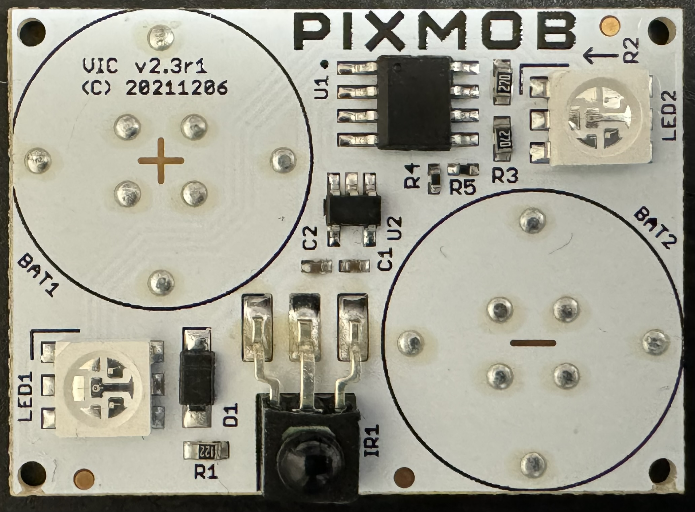
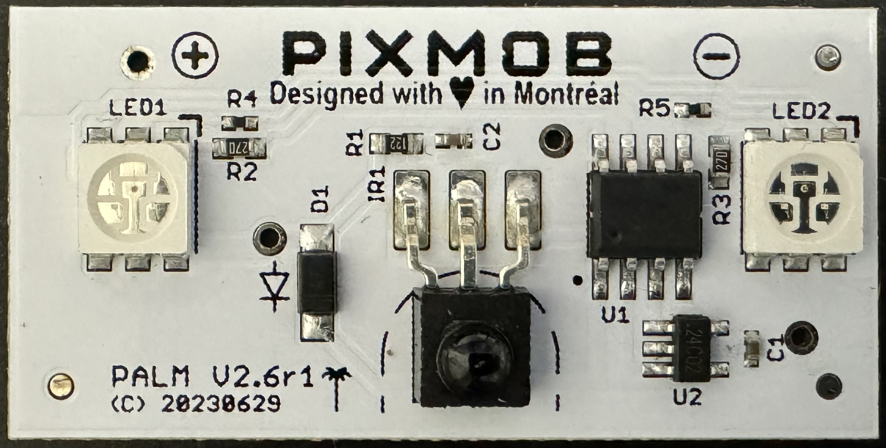

# PixMob IR Protocol Reverse Engineering
PixMob wristbands are small, light-up devices distributed to audience members at concerts or other live events. The devices are controlled remotely using radio frequency (RF), Bluetooth Low Energy (BLE), or 38 kHz modulated infrared light (IR) to illuminate special effects and shapes spread across the crowd. However, after the conclusion of an event, PixMob wristbands are left in a state of limited functionality and cannot be customized by the user without access to special hardware and software.

This project focuses on extracting and reverse engineering the firmware for IR-based PixMob devices to better understand its communications protocol and modes of operation. 

Using the IR protocol definitions from this repo, it's now possible to recreate at home custom effects such as displaying any RGB color for varying durations, fading colors in and out, mixing different colors together, repeating effects, setting random display probabilities, and much more.

## Protocol Definitions & Examples
The main IR protocol command definitions are located in [pixmob_ir_protocol.py](pixmob_ir_protocol.py). This file can be imported or ported into your project to generate encoded IR command sequences, which can then be sent to your PixMob device(s) using the [Arduino Sender found in danielweidman/pixmob-ir-reverse-engineering](https://github.com/danielweidman/pixmob-ir-reverse-engineering).

Example usage of the protocol command classes can be found in [pixmob_ir_protocol_examples.py](pixmob_ir_protocol_examples.py).

More details about each command, its parameter fields, and side effects can be found in [docs/ir_protocol.md](docs/ir_protocol.md) and [docs/operation.md](docs/operation.md).

## Extracting & Reverse Engineering Firmware
The IR-based PixMob devices analyzed for this project run on an 8-bit Nyquest NY8A054ES8 MCU.

Using a logic capture of the *NY8 OTP Writer* hardware programmer, I created an Arduino program ([ny8_dumper/ny8_dumper.ino](ny8_dumper/ny8_dumper.ino)) that implements a part of Nyquest's SPI-like programming protocol to dump the firmware from the MCU.

I also created a [NY8A054E Ghidra Processor](https://github.com/jamesw343/Ghidra_NY8A054E) to assist with reverse engineering the PixMob firmware dumped in the previous step.

For more details, see [ny8_dumper/README.md](ny8_dumper/README.md).

## Tested Devices Models
The table below documents the different IR-based PixMob devices analyzed for this project. The core hardware generally consists of an unmarked MCU (later found to be a Nyquest NY8A054ES8) in a SOP-8 package, an I2C EEPROM in a SOT23 package, a 38 kHz IR receiver, and RGB LEDs.

| Model | PCB                              | Known Firmware Version(s) |
| :---: | :-------------------------------:| :-----------------------: |
| X2    | PALM v2.1 (c) 20210725           | 0x01                      |
| X4    | AURORA v1.7 (c) 20211027         | 0x02                      |
| NOVA  | FRENCH VANILLA v3.1 (c) 20210920 | 0x05                      |
| X2    |  VIC v2.3r1 (c) 20211206     | 0x06, 0x08 |
| X2    |  PALM v2.6r1 (c) 20230629  | 0x08 |

> [!NOTE]
> While the basic commands in PixMob's IR protocol are generally stable, some features may have varying levels of support from device-to-device.

## Acknowledgements & Mentions

* [@cra0](https://github.com/cra0) for pointing out the MCU model as NyQuest NY8A054ES8
* [@sean1983](https://github.com/sean1983) for detailed documentation of PixMob's effects and helping me test effects on a wider variety of PixMob models
* [@danielweidman](https://github.com/danielweidman), [danielweidman/pixmob-ir-reverse-engineering](https://github.com/danielweidman/pixmob-ir-reverse-engineering/), and contributors for effect definitions and Arduino IR sender program

For more PixMob-related projects, check out the PixMob reverse engineering discord server: [https://discord.gg/UYqTjC7xp3](https://discord.gg/UYqTjC7xp3)