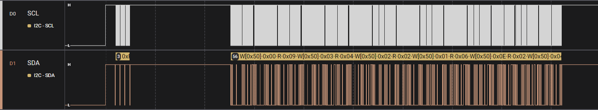
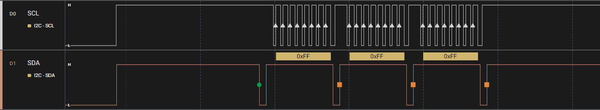
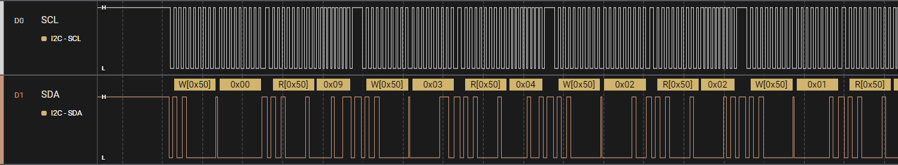
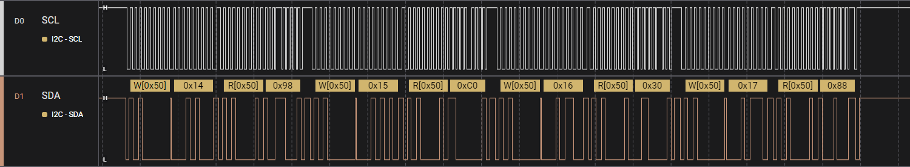

# PixMob EEPROM
The external EEPROM on my PixMob PALM v2.6r1 (c) 20230629 was in a 5-pin SOT23 package and marked `24C02`, which I found to be a 2Kbit (256 x 8 bits) I2C chip.

Of the ten PixMob VIC v2.3r1 (c) 20211206 I had purchased from eBay, nine of them had EEPROMs marked `AKI**`, where the last two characters were random letters, and one of them had an EEPROM marked `24C02`.

## Investigation

I started my reverse engineering journey at the EEPROM, hoping that it stored the MCU firmware, since dumping an I2C EEPROM is non-destructive and fairly trivial.

Using a logic analyzer, I captured the I2C traffic on the SCL and SDA pins between the MCU and the EEPROM. 

An overview of the entire power-on sequence is shown below:


The first three bytes appear to be invalid and do not conform to I2C protocol:


After an approximately 2ms pause, it begins to read from the EEPROM (I2C device address 0x50):


The complete power-on read sequence was: 0x00, 0x03, 0x02, 0x01, 0x0E, 0x04, 0x50, 0x51, 0x52, 0x53, 0x54, 0x55, 0x56, 0x57

After the power-on sequence, I observed periodic reads that happened as the LEDs were changing colors. I would later find out that this was the reading of the color profiles RGB values and checksum (in this particular capture, it was reading from profile id 1 in EEPROM locations 0x14-0x17):


After further testing, I came to the conclusion that the EEPROM held only colors and configuration data, since there was no way any instructions were being read from the EEPROM given the quantity and frequency of reads. The actual PixMob firmware must instead be stored internally in the MCU.

After dumping and analyzing the MCU firmware, I was able to get a better understanding of the different fields in the EEPROM and their purposes.


## EEPROM Layout
Only the first 88 bytes of the EEPROM are used to store information. The remaining 168 bytes are left blank (0xFF) and not touched by the firmware.

The high-level layout of the EEPROM is as follows (each cell in the diagram is 8 bits / 1 byte):
```
             0x00                0x01                0x02                0x03        
     +-------------------+-------------------+-------------------+-------------------+
0x00 |      version      |     group_sel     |   repeat_delay    |   repeat_count    |
     +-------------------+-------------------+-------------------+-------------------+
0x04 |     on_start      |   ** UNUSED **    |   ** UNUSED **    |   ** UNUSED **    |
     +-------------------+-------------------+-------------------+-------------------+
0x08 |  group_sel_0_id   |  group_sel_1_id   |  group_sel_2_id   |  group_sel_3_id   |
     +-------------------+-------------------+-------------------+-------------------+
0x0C |  group_sel_4_id   |  group_sel_5_id   |  group_sel_6_id   |  group_sel_7_id   |
     +-------------------+-------------------+-------------------+-------------------+
0x10 |  profile_0.green  |   profile_0.red   |  profile_0.blue   | profile_0.chksum  |
     +-------------------+-------------------+-------------------+-------------------+
0x14 |  profile_1.green  |   profile_1.red   |  profile_1.blue   | profile_1.chksum  |
     +-------------------+-------------------+-------------------+-------------------+
0x18 |  profile_2.green  |   profile_2.red   |  profile_2.blue   | profile_2.chksum  |
     +-------------------+-------------------+-------------------+-------------------+
0x1C |  profile_3.green  |   profile_3.red   |  profile_3.blue   | profile_3.chksum  |
     +-------------------+-------------------+-------------------+-------------------+
0x20 |  profile_4.green  |   profile_4.red   |  profile_4.blue   | profile_4.chksum  |
     +-------------------+-------------------+-------------------+-------------------+
0x24 |  profile_5.green  |   profile_5.red   |  profile_5.blue   | profile_5.chksum  |
     +-------------------+-------------------+-------------------+-------------------+
0x28 |  profile_6.green  |   profile_6.red   |  profile_6.blue   | profile_6.chksum  |
     +-------------------+-------------------+-------------------+-------------------+
0x2C |  profile_7.green  |   profile_7.red   |  profile_7.blue   | profile_7.chksum  |
     +-------------------+-------------------+-------------------+-------------------+
0x30 |  profile_8.green  |   profile_8.red   |  profile_8.blue   | profile_8.chksum  |
     +-------------------+-------------------+-------------------+-------------------+
0x34 |  profile_9.green  |   profile_9.red   |  profile_9.blue   | profile_9.chksum  |
     +-------------------+-------------------+-------------------+-------------------+
0x38 | profile_10.green  |  profile_10.red   |  profile_10.blue  | profile_10.chksum |
     +-------------------+-------------------+-------------------+-------------------+
0x3C | profile_11.green  |  profile_11.red   |  profile_11.blue  | profile_11.chksum |
     +-------------------+-------------------+-------------------+-------------------+
0x40 | profile_12.green  |  profile_12.red   |  profile_12.blue  | profile_12.chksum |
     +-------------------+-------------------+-------------------+-------------------+
0x44 | profile_13.green  |  profile_13.red   |  profile_13.blue  | profile_13.chksum |
     +-------------------+-------------------+-------------------+-------------------+
0x48 | profile_14.green  |  profile_14.red   |  profile_14.blue  | profile_14.chksum |
     +-------------------+-------------------+-------------------+-------------------+
0x4C | profile_15.green  |  profile_15.red   |  profile_15.blue  | profile_15.chksum |
     +-------------------+-------------------+-------------------+-------------------+
0x50 |     cfg green     |      cfg red      |     cfg blue      |    cfg attack     |
     +-------------------+-------------------+-------------------+-------------------+
0x54 |    cfg sustain    |    cfg release    | cfg profile range |     cfg mode      |
     +-------------------+-------------------+-------------------+-------------------+
```

| Address | &nbsp;&nbsp;&nbsp;&nbsp;&nbsp;&nbsp;&nbsp;&nbsp;&nbsp;&nbsp;&nbsp;&nbsp;Field&nbsp;&nbsp;&nbsp;&nbsp;&nbsp;&nbsp;&nbsp;&nbsp;&nbsp;&nbsp;&nbsp;&nbsp; | Field Description |
| :---: | :---: | :--- |
| 0x00 | `EEPROM:version` | <p>A constant value that is specific to the firmware version running on the PixMob MCU. An unexpected value here will cause the MCU to overwrite the first 88 used bytes of the EEPROM back to factory defaults. |
| 0x01 | `EEPROM:group_sel` | Lower 3 bits are used to select one of eight group id values (located in EEPROM addresses 0x08 through 0x0F) to determine the PixMob's group identity. Upper 5 bits are ignored. |
| 0x02 | `EEPROM:repeat_delay` | Delay time between repetitions of an effect, used when repeat mode is enabled. Value is in milliseconds with a 16ms multiplier (for example, a value of 0x1E would be 480ms). |
| 0x03 | `EEPROM:repeat_count` | Total number of repetitions of an effect to perform before stopping, used when repeat mode is enabled. |
| 0x04 | `EEPROM:on_start` | When set to 0x11, this will enable the "on-start" effect, which upon initial power-on, will begin reading color profiles from the EEPROM and displaying their effects on the LEDs in an endless cycle.<br /><br />Any other value causes the "on-start" effect to be disabled, in which case the PixMob displays nothing as it waits to receive the next command from the IR receiver. |
| 0x08<br />-<br />0x0F | `EEPROM:group_sel_0_id`<br />through<br />`EEPROM:group_sel_7_id` | Each memory location contains a 5-bit group id ranging between 1-31 (0 is the universal group, in other words, all PixMob devices concurrently belong to both group 0 and the defined group id). |
| 0x10<br />-<br />0x4F | `EEPROM:profile_0`<br />through<br />`EEPROM:profile_15` | Defines 16 configurable RGB color profiles. The `profile.green`, `profile.red`, and `profile.blue` fields each hold an 8-bit RGB value from 0-255 (but because of 6-bit command encoding, the lower 2 bits of each RGB value will always be zero).<br /><br />The `profile.checksum` is the lower 8 bits of the sum of `profile.red`+`profile.green`+`profile.blue`. When reading a color profile from EEPROM, an invalid checksum will cause the RGB values to all be read as zero instead of their actual values. |
| 0x50<br />-<br />0x57 | `EEPROM:cfg` | The last 8 bytes of the usable EEPROM form the cfg struct whose structure is mirrored in the MCU's general-purpose registers as `MCU:cfg2`.<br /><br />See the [Configuration Structures (cfg)](operation.md#configuration-structures-cfg) for more details. |


## EEPROM Factory Defaults
An unexpected `EEPROM:version` value will cause the MCU to reset the 88 usable bytes of EEPROM to factory defaults.

Factory defaults for the PixMob PALM v2.6r1 and PixMob VIC v2.3r1 using `24C02` EEPROMs and firmware with `EEPROM:version=0x09`:
```
0x09 0x00 0x00 0x01
0x00 0x00 0x00 0x00
0x01 0x01 0x01 0x01
0x01 0x01 0x01 0x01
0x00 0xBF 0x00 0xBF
0x00 0xBF 0x60 0x1F
0x00 0x60 0xBF 0x1F
0x00 0x00 0xBF 0xBF
0xBF 0x00 0xBF 0x7E
0xBF 0x00 0x00 0xBF
0xBF 0xBF 0x00 0x7E
0x60 0xBF 0x00 0x1F
0x00 0x00 0x00 0x00
0x00 0x00 0x00 0x00
0x00 0x00 0x00 0x00
0x00 0x00 0x00 0x00
0x00 0x00 0x00 0x00
0x00 0x00 0x00 0x00
0x00 0x00 0x00 0x00
0xBF 0xBF 0xBF 0x3D
0x00 0x00 0x00 0x1E
0x1E 0x1E 0x70 0x06
```

Factory defaults for the PixMob VIC v2.3r1 using `AKI**` EEPROMs and firmware with `EEPROM:version=0x07`:
```
0x07 0x00 0x00 0x01
0x00 0x00 0x00 0x00
0x01 0x01 0x01 0x01
0x01 0x01 0x01 0x01
0x00 0xCC 0x00 0xCC
0x00 0xCC 0x66 0x32
0x00 0x66 0xCC 0x32
0x00 0x00 0xCC 0xCC
0xCC 0x00 0xCC 0x98
0xCC 0x00 0x00 0xCC
0xCC 0xCC 0x00 0x98
0x66 0xCC 0x00 0x32
0x00 0x00 0x00 0x00
0x00 0x00 0x00 0x00
0x00 0x00 0x00 0x00
0x00 0x00 0x00 0x00
0x00 0x00 0x00 0x00
0x00 0x00 0x00 0x00
0x00 0x00 0x00 0x00
0xCC 0xCC 0xCC 0x64
0x00 0x00 0x00 0x1E
0x1E 0x1E 0x70 0x06
```
