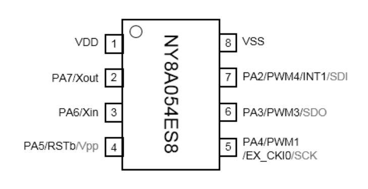
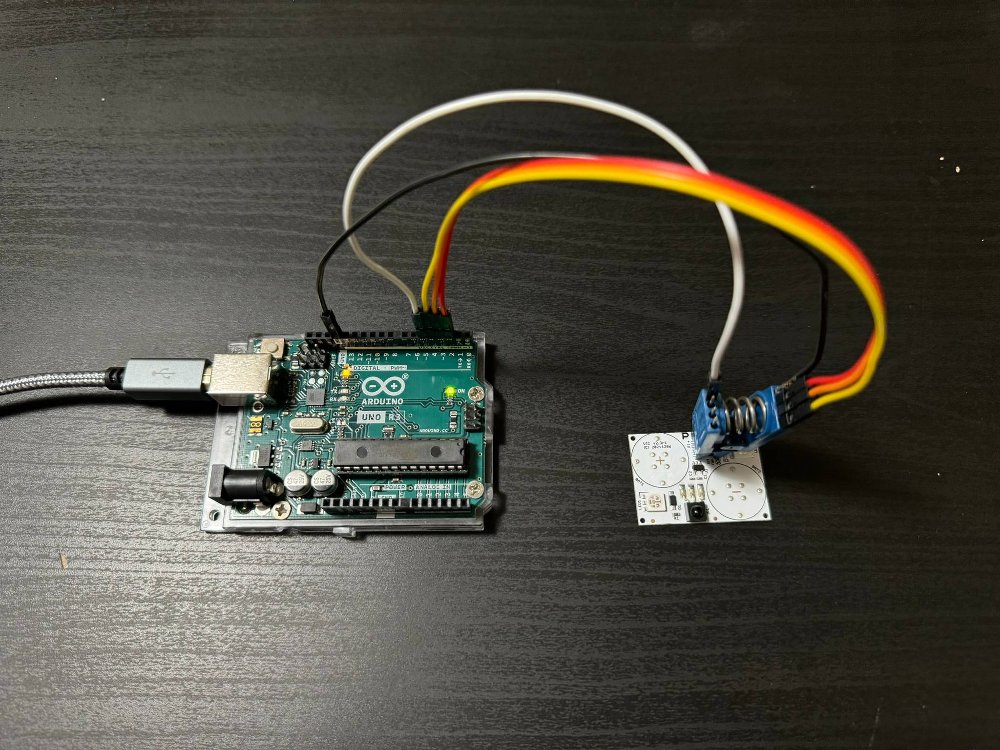
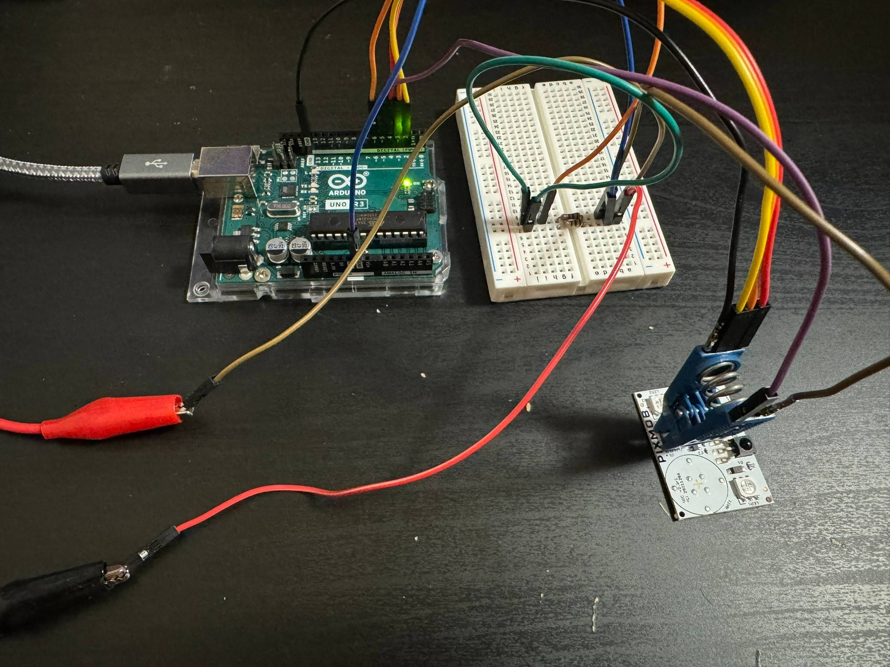

# Nyquest NY8A054E MCU Firmware Dumper
Arduino program designed to extract the firmware from a Nyquest NY8A054E 8-bit MCU.

The NY8 family of 8-bit MCUs use a proprietary programming protocol and can only be written to using Nyquest's custom NY8 OTP Writer programming tool, which is expensive and only available from overseas vendors. Luckily, someone had posted [logic analyzer captures of the NY8 programming process](https://www.eevblog.com/forum/blog/eevblog-1144-padauk-programmer-reverse-engineering/msg4434847/#msg4434847) online, which this program is based upon.

This program has been successfully tested on the following PixMob boards:
* PixMob PALM v2.6r1 (c) 20230629 with 24C02 EEPROM chip (dumped firmware version 9)
* PixMob VIC v2.3r1 (c) 20211206 with 24C02 EEPROM chip (dumped firmware version 9)
* PixMob VIC v2.3r1 (c) 20211206 with AKI** EEPROM chip (dumped firmware version 7, required Vpp)

# Usage

The NY8A054E MCU datasheet specifies that to enter EPROM programming mode, a programming voltage greater than 7.75V must be applied to the pin Vpp. However, I found that some MCUs on certain PixMob boards are able to dump their firmware contents without needing this voltage.

Since the Arduino is only 5V, generating a 7.75V+ programming voltage requires additional hardware. Thus, this program supports two modes: one that uses Vpp, and one that uses only the on-board 5V digital IO. I recommend starting with the latter since it's a simpler hardware setup.


## Dumping Firmware Without Vpp
The MCU is connected directly to the Arduino using a SOIC 8-pin test clip:
* MCU SDI to Arduino Pin 2
* MCU SDO to Arduino Pin 3
* MCU SCK to Arduino Pin 4
* MCU VDD to Arduino Pin 5
* MCU VSS to Arduino GND





The programming sequence requires that a special handshake be sent within a certain time frame after MCU power-on, so the Arduino must control power to the MCU.

The PixMob board design has a diode between the battery Vin and the MCU VDD, while the LEDs are connected directly to the battery Vin. This allows us to operate the MCU directly from the Arduino without exceeding any digital output pins' current limits.

Once wired, connect to the Arduino serial monitor and press "\<Enter>" to begin the EPROM extraction process. If successful, 2K x 14-bit EPROM words will be dumped.

```
Ready. Press enter to run.
Begin EPROM extraction ...

389F 0000 0000 0000 0000 0000 0000 0000
00C7 15C7 0103 00C8 0104 00C9 0101 080F
...
0000 0000 0000 0000 0000 0000 0000 0000
0000 0000 0000 0000 0000 0000 3FE9 16B0
```

If you have trouble copying the output from the Arduino IDE's serial console, try using another serial console like PuTTY instead.

An unsuccessful dump will produce the following output, in which case, proceed to [Dumping Firmware With Vpp](#dumping-firmware-with-vpp).
```
Ready. Press enter to run.
Begin EPROM extraction ...

EPROM dump failed: handshake unsuccessful.
```


## Dumping Firmware With Vpp
To run with Vpp programming voltage, I used an external benchtop power supply configured to output 7.9V. The output of the power supply was connected directly to the Vpp pin on the MCU. I also connected the power supply output to the Arduino Pin 6 through a simple voltage divider.



> [!WARNING]
> Please carefully review your PixMob board's design before applying 7.9V to the Vpp pin. It could potentially cause damage to other components. You may want to isolate the MCU prior to applying Vpp.

Now, update the `ny8_dumper.ino` program to enable VPP mode:
```c
#define MCU_REQUIRES_VPP 1
```

Instead of listening for the start trigger from the serial console, the Arduino will trigger the dump process when it detects Vpp has been enabled (power supply output turned on).

A successful dump should look like:
```
Ready. Waiting for VPP sense...
<<< power supply output is turned on here >>>
Begin EPROM extraction ...

38AA 0000 0000 0000 0000 0000 0000 0000
00C7 15C7 0103 00C8 0104 00C9 0101 080F
...
0000 0000 0000 0000 0000 0000 0000 0000
0000 0000 0000 0000 0000 0000 3FDD 39E4
```


# Analyzing Firmware

Now, the output can be converted into binary and analyzed in [Ghidra](https://github.com/NationalSecurityAgency/ghidra) with the [Ghidra NY8A054E Processor](https://github.com/Lyphiard/Ghidra_NY8A054E).

```bash
$ cat pixmob_firmware.hex
389F 0000 0000 0000 0000 0000 0000 0000
00C7 15C7 0103 00C8 0104 00C9 0101 080F
...
0000 0000 0000 0000 0000 0000 0000 0000
0000 0000 0000 0000 0000 0000 3FE9 16B0

$ xxd -r -p pixmob_firmware.hex > pixmob_firmware.bin
```

> [!NOTE]
> To avoid copyright issues, the dumped firmware contents will not be included in this repository.
